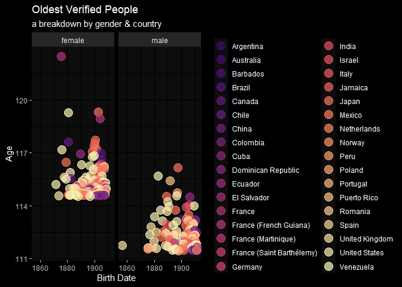

Centenarians
================
fth

### loading packages

``` r
library(dplyr)
library(tidyr)
library(ggplot2)
library(stringr)
library(lubridate)
library(gt)
library(rvest)
```

### get data

``` r
# data loc: 
root <- paste0("https://en.wikipedia.org/wiki/List_of_verified_oldest_people") 
tables <- read_html(root) |> html_nodes("table")

# get data by gender: 
old_women <- tables[[1]] |> 
  html_table(header = TRUE) |>
  mutate(
    gender = 'female'
  )

old_men <- tables[[2]] |> 
  html_table(header = TRUE) |>
  mutate(
    gender = 'male'
  )
```

### wrangling

``` r
# fix headers: 
cols <- c('rank', 'name', 'birth_date', 'death_date', 'age', 'place_of_death_or_residence', 'gender')

colnames(old_women) <- cols
colnames(old_men)   <- cols

# bind all ppl: 
old_ppl <- old_women |> rbind(old_men)


# remove [reference] indices, fix date coltypes & age calc in year fractions:
old_ppl <-
old_ppl |>
  mutate( # regex
    name = str_replace(name, "\\[.*]", ""),
    birth_date = str_replace(birth_date, "\\[.*]", ""),
    death_date = str_replace(death_date, "\\[.*]", ""),
    place_of_death_or_residence = str_replace(place_of_death_or_residence, "\\[.*]", "")
  ) |>
  mutate( # dates & age formatting
    birth_date = dmy(birth_date),
    death_date = dmy(death_date),
    still_alive = ifelse(is.na(death_date), "alive", "deceased"),
    age  = ifelse(still_alive == "alive", 
                  as.numeric(interval(birth_date, Sys.Date()), 'years'), 
                  as.numeric(interval(birth_date, death_date), 'years'))
    )
```

### eda

``` r
old_ppl |>
  ggplot() + 
  geom_point(aes(x = birth_date, y = age, color = place_of_death_or_residence #, shape = still_alive
                 ), size = 5, alpha = .7) + 
  scale_color_viridis_d(option = "A", begin = .2) +
facet_wrap(~gender) + 
  labs(
    title = "Oldest Verified People",
    subtitle = "a breakdown by gender & country",
    x = "Birth Date",
    y = "Age"
  ) + 
  theme_minimal() +
  ggdark::dark_mode() + 
  theme(
    panel.background = element_rect(fill = "grey5", color = "grey5"),
    legend.title = element_blank() #,
#    legend.position = "bottom"
  )
```



``` r
old_ppl |>
  arrange(desc(age)) |>
  slice(1:20) |>
  select(rank, name, gender, age, place_of_death_or_residence, birth_date) |> 
  rename('place of residence' = 'place_of_death_or_residence',
         'birth date' = 'birth_date') |>
  mutate(
    age = round(age)
  ) |>
  gt() |>
  tab_header(title = md('**Oldest Verified People Dataset**'),
             subtitle = md('top 20 oldest people')) |>
  tab_footnote(
    md("*top 20 oldest people are all female*")
  )
```

<div id="oywycgjgjv" style="padding-left:0px;padding-right:0px;padding-top:10px;padding-bottom:10px;overflow-x:auto;overflow-y:auto;width:auto;height:auto;">
<style>html {
  font-family: -apple-system, BlinkMacSystemFont, 'Segoe UI', Roboto, Oxygen, Ubuntu, Cantarell, 'Helvetica Neue', 'Fira Sans', 'Droid Sans', Arial, sans-serif;
}

#oywycgjgjv .gt_table {
  display: table;
  border-collapse: collapse;
  margin-left: auto;
  margin-right: auto;
  color: #333333;
  font-size: 16px;
  font-weight: normal;
  font-style: normal;
  background-color: #FFFFFF;
  width: auto;
  border-top-style: solid;
  border-top-width: 2px;
  border-top-color: #A8A8A8;
  border-right-style: none;
  border-right-width: 2px;
  border-right-color: #D3D3D3;
  border-bottom-style: solid;
  border-bottom-width: 2px;
  border-bottom-color: #A8A8A8;
  border-left-style: none;
  border-left-width: 2px;
  border-left-color: #D3D3D3;
}

#oywycgjgjv .gt_heading {
  background-color: #FFFFFF;
  text-align: center;
  border-bottom-color: #FFFFFF;
  border-left-style: none;
  border-left-width: 1px;
  border-left-color: #D3D3D3;
  border-right-style: none;
  border-right-width: 1px;
  border-right-color: #D3D3D3;
}

#oywycgjgjv .gt_caption {
  padding-top: 4px;
  padding-bottom: 4px;
}

#oywycgjgjv .gt_title {
  color: #333333;
  font-size: 125%;
  font-weight: initial;
  padding-top: 4px;
  padding-bottom: 4px;
  padding-left: 5px;
  padding-right: 5px;
  border-bottom-color: #FFFFFF;
  border-bottom-width: 0;
}

#oywycgjgjv .gt_subtitle {
  color: #333333;
  font-size: 85%;
  font-weight: initial;
  padding-top: 0;
  padding-bottom: 6px;
  padding-left: 5px;
  padding-right: 5px;
  border-top-color: #FFFFFF;
  border-top-width: 0;
}

#oywycgjgjv .gt_bottom_border {
  border-bottom-style: solid;
  border-bottom-width: 2px;
  border-bottom-color: #D3D3D3;
}

#oywycgjgjv .gt_col_headings {
  border-top-style: solid;
  border-top-width: 2px;
  border-top-color: #D3D3D3;
  border-bottom-style: solid;
  border-bottom-width: 2px;
  border-bottom-color: #D3D3D3;
  border-left-style: none;
  border-left-width: 1px;
  border-left-color: #D3D3D3;
  border-right-style: none;
  border-right-width: 1px;
  border-right-color: #D3D3D3;
}

#oywycgjgjv .gt_col_heading {
  color: #333333;
  background-color: #FFFFFF;
  font-size: 100%;
  font-weight: normal;
  text-transform: inherit;
  border-left-style: none;
  border-left-width: 1px;
  border-left-color: #D3D3D3;
  border-right-style: none;
  border-right-width: 1px;
  border-right-color: #D3D3D3;
  vertical-align: bottom;
  padding-top: 5px;
  padding-bottom: 6px;
  padding-left: 5px;
  padding-right: 5px;
  overflow-x: hidden;
}

#oywycgjgjv .gt_column_spanner_outer {
  color: #333333;
  background-color: #FFFFFF;
  font-size: 100%;
  font-weight: normal;
  text-transform: inherit;
  padding-top: 0;
  padding-bottom: 0;
  padding-left: 4px;
  padding-right: 4px;
}

#oywycgjgjv .gt_column_spanner_outer:first-child {
  padding-left: 0;
}

#oywycgjgjv .gt_column_spanner_outer:last-child {
  padding-right: 0;
}

#oywycgjgjv .gt_column_spanner {
  border-bottom-style: solid;
  border-bottom-width: 2px;
  border-bottom-color: #D3D3D3;
  vertical-align: bottom;
  padding-top: 5px;
  padding-bottom: 5px;
  overflow-x: hidden;
  display: inline-block;
  width: 100%;
}

#oywycgjgjv .gt_group_heading {
  padding-top: 8px;
  padding-bottom: 8px;
  padding-left: 5px;
  padding-right: 5px;
  color: #333333;
  background-color: #FFFFFF;
  font-size: 100%;
  font-weight: initial;
  text-transform: inherit;
  border-top-style: solid;
  border-top-width: 2px;
  border-top-color: #D3D3D3;
  border-bottom-style: solid;
  border-bottom-width: 2px;
  border-bottom-color: #D3D3D3;
  border-left-style: none;
  border-left-width: 1px;
  border-left-color: #D3D3D3;
  border-right-style: none;
  border-right-width: 1px;
  border-right-color: #D3D3D3;
  vertical-align: middle;
  text-align: left;
}

#oywycgjgjv .gt_empty_group_heading {
  padding: 0.5px;
  color: #333333;
  background-color: #FFFFFF;
  font-size: 100%;
  font-weight: initial;
  border-top-style: solid;
  border-top-width: 2px;
  border-top-color: #D3D3D3;
  border-bottom-style: solid;
  border-bottom-width: 2px;
  border-bottom-color: #D3D3D3;
  vertical-align: middle;
}

#oywycgjgjv .gt_from_md > :first-child {
  margin-top: 0;
}

#oywycgjgjv .gt_from_md > :last-child {
  margin-bottom: 0;
}

#oywycgjgjv .gt_row {
  padding-top: 8px;
  padding-bottom: 8px;
  padding-left: 5px;
  padding-right: 5px;
  margin: 10px;
  border-top-style: solid;
  border-top-width: 1px;
  border-top-color: #D3D3D3;
  border-left-style: none;
  border-left-width: 1px;
  border-left-color: #D3D3D3;
  border-right-style: none;
  border-right-width: 1px;
  border-right-color: #D3D3D3;
  vertical-align: middle;
  overflow-x: hidden;
}

#oywycgjgjv .gt_stub {
  color: #333333;
  background-color: #FFFFFF;
  font-size: 100%;
  font-weight: initial;
  text-transform: inherit;
  border-right-style: solid;
  border-right-width: 2px;
  border-right-color: #D3D3D3;
  padding-left: 5px;
  padding-right: 5px;
}

#oywycgjgjv .gt_stub_row_group {
  color: #333333;
  background-color: #FFFFFF;
  font-size: 100%;
  font-weight: initial;
  text-transform: inherit;
  border-right-style: solid;
  border-right-width: 2px;
  border-right-color: #D3D3D3;
  padding-left: 5px;
  padding-right: 5px;
  vertical-align: top;
}

#oywycgjgjv .gt_row_group_first td {
  border-top-width: 2px;
}

#oywycgjgjv .gt_summary_row {
  color: #333333;
  background-color: #FFFFFF;
  text-transform: inherit;
  padding-top: 8px;
  padding-bottom: 8px;
  padding-left: 5px;
  padding-right: 5px;
}

#oywycgjgjv .gt_first_summary_row {
  border-top-style: solid;
  border-top-color: #D3D3D3;
}

#oywycgjgjv .gt_first_summary_row.thick {
  border-top-width: 2px;
}

#oywycgjgjv .gt_last_summary_row {
  padding-top: 8px;
  padding-bottom: 8px;
  padding-left: 5px;
  padding-right: 5px;
  border-bottom-style: solid;
  border-bottom-width: 2px;
  border-bottom-color: #D3D3D3;
}

#oywycgjgjv .gt_grand_summary_row {
  color: #333333;
  background-color: #FFFFFF;
  text-transform: inherit;
  padding-top: 8px;
  padding-bottom: 8px;
  padding-left: 5px;
  padding-right: 5px;
}

#oywycgjgjv .gt_first_grand_summary_row {
  padding-top: 8px;
  padding-bottom: 8px;
  padding-left: 5px;
  padding-right: 5px;
  border-top-style: double;
  border-top-width: 6px;
  border-top-color: #D3D3D3;
}

#oywycgjgjv .gt_striped {
  background-color: rgba(128, 128, 128, 0.05);
}

#oywycgjgjv .gt_table_body {
  border-top-style: solid;
  border-top-width: 2px;
  border-top-color: #D3D3D3;
  border-bottom-style: solid;
  border-bottom-width: 2px;
  border-bottom-color: #D3D3D3;
}

#oywycgjgjv .gt_footnotes {
  color: #333333;
  background-color: #FFFFFF;
  border-bottom-style: none;
  border-bottom-width: 2px;
  border-bottom-color: #D3D3D3;
  border-left-style: none;
  border-left-width: 2px;
  border-left-color: #D3D3D3;
  border-right-style: none;
  border-right-width: 2px;
  border-right-color: #D3D3D3;
}

#oywycgjgjv .gt_footnote {
  margin: 0px;
  font-size: 90%;
  padding-left: 4px;
  padding-right: 4px;
  padding-left: 5px;
  padding-right: 5px;
}

#oywycgjgjv .gt_sourcenotes {
  color: #333333;
  background-color: #FFFFFF;
  border-bottom-style: none;
  border-bottom-width: 2px;
  border-bottom-color: #D3D3D3;
  border-left-style: none;
  border-left-width: 2px;
  border-left-color: #D3D3D3;
  border-right-style: none;
  border-right-width: 2px;
  border-right-color: #D3D3D3;
}

#oywycgjgjv .gt_sourcenote {
  font-size: 90%;
  padding-top: 4px;
  padding-bottom: 4px;
  padding-left: 5px;
  padding-right: 5px;
}

#oywycgjgjv .gt_left {
  text-align: left;
}

#oywycgjgjv .gt_center {
  text-align: center;
}

#oywycgjgjv .gt_right {
  text-align: right;
  font-variant-numeric: tabular-nums;
}

#oywycgjgjv .gt_font_normal {
  font-weight: normal;
}

#oywycgjgjv .gt_font_bold {
  font-weight: bold;
}

#oywycgjgjv .gt_font_italic {
  font-style: italic;
}

#oywycgjgjv .gt_super {
  font-size: 65%;
}

#oywycgjgjv .gt_footnote_marks {
  font-style: italic;
  font-weight: normal;
  font-size: 75%;
  vertical-align: 0.4em;
}

#oywycgjgjv .gt_asterisk {
  font-size: 100%;
  vertical-align: 0;
}

#oywycgjgjv .gt_indent_1 {
  text-indent: 5px;
}

#oywycgjgjv .gt_indent_2 {
  text-indent: 10px;
}

#oywycgjgjv .gt_indent_3 {
  text-indent: 15px;
}

#oywycgjgjv .gt_indent_4 {
  text-indent: 20px;
}

#oywycgjgjv .gt_indent_5 {
  text-indent: 25px;
}
</style>
<table class="gt_table">
  <thead class="gt_header">
    <tr>
      <td colspan="6" class="gt_heading gt_title gt_font_normal" style><strong>Oldest Verified People Dataset</strong></td>
    </tr>
    <tr>
      <td colspan="6" class="gt_heading gt_subtitle gt_font_normal gt_bottom_border" style>top 20 oldest people</td>
    </tr>
  </thead>
  <thead class="gt_col_headings">
    <tr>
      <th class="gt_col_heading gt_columns_bottom_border gt_right" rowspan="1" colspan="1" scope="col" id="rank">rank</th>
      <th class="gt_col_heading gt_columns_bottom_border gt_left" rowspan="1" colspan="1" scope="col" id="name">name</th>
      <th class="gt_col_heading gt_columns_bottom_border gt_left" rowspan="1" colspan="1" scope="col" id="gender">gender</th>
      <th class="gt_col_heading gt_columns_bottom_border gt_right" rowspan="1" colspan="1" scope="col" id="age">age</th>
      <th class="gt_col_heading gt_columns_bottom_border gt_left" rowspan="1" colspan="1" scope="col" id="place of residence">place of residence</th>
      <th class="gt_col_heading gt_columns_bottom_border gt_right" rowspan="1" colspan="1" scope="col" id="birth date">birth date</th>
    </tr>
  </thead>
  <tbody class="gt_table_body">
    <tr><td headers="rank" class="gt_row gt_right">1</td>
<td headers="name" class="gt_row gt_left">Jeanne Calment</td>
<td headers="gender" class="gt_row gt_left">female</td>
<td headers="age" class="gt_row gt_right">122</td>
<td headers="place of residence" class="gt_row gt_left">France</td>
<td headers="birth date" class="gt_row gt_right">1875-02-21</td></tr>
    <tr><td headers="rank" class="gt_row gt_right">2</td>
<td headers="name" class="gt_row gt_left">Kane Tanaka</td>
<td headers="gender" class="gt_row gt_left">female</td>
<td headers="age" class="gt_row gt_right">119</td>
<td headers="place of residence" class="gt_row gt_left">Japan</td>
<td headers="birth date" class="gt_row gt_right">1903-01-02</td></tr>
    <tr><td headers="rank" class="gt_row gt_right">3</td>
<td headers="name" class="gt_row gt_left">Sarah Knauss</td>
<td headers="gender" class="gt_row gt_left">female</td>
<td headers="age" class="gt_row gt_right">119</td>
<td headers="place of residence" class="gt_row gt_left">United States</td>
<td headers="birth date" class="gt_row gt_right">1880-09-24</td></tr>
    <tr><td headers="rank" class="gt_row gt_right">4</td>
<td headers="name" class="gt_row gt_left">Lucile Randon</td>
<td headers="gender" class="gt_row gt_left">female</td>
<td headers="age" class="gt_row gt_right">119</td>
<td headers="place of residence" class="gt_row gt_left">France</td>
<td headers="birth date" class="gt_row gt_right">1904-02-11</td></tr>
    <tr><td headers="rank" class="gt_row gt_right">5</td>
<td headers="name" class="gt_row gt_left">Nabi Tajima</td>
<td headers="gender" class="gt_row gt_left">female</td>
<td headers="age" class="gt_row gt_right">118</td>
<td headers="place of residence" class="gt_row gt_left">Japan</td>
<td headers="birth date" class="gt_row gt_right">1900-08-04</td></tr>
    <tr><td headers="rank" class="gt_row gt_right">6</td>
<td headers="name" class="gt_row gt_left">Marie-Louise Meilleur</td>
<td headers="gender" class="gt_row gt_left">female</td>
<td headers="age" class="gt_row gt_right">118</td>
<td headers="place of residence" class="gt_row gt_left">Canada</td>
<td headers="birth date" class="gt_row gt_right">1880-08-29</td></tr>
    <tr><td headers="rank" class="gt_row gt_right">7</td>
<td headers="name" class="gt_row gt_left">Violet Brown</td>
<td headers="gender" class="gt_row gt_left">female</td>
<td headers="age" class="gt_row gt_right">118</td>
<td headers="place of residence" class="gt_row gt_left">Jamaica</td>
<td headers="birth date" class="gt_row gt_right">1900-03-10</td></tr>
    <tr><td headers="rank" class="gt_row gt_right">8</td>
<td headers="name" class="gt_row gt_left">Emma Morano</td>
<td headers="gender" class="gt_row gt_left">female</td>
<td headers="age" class="gt_row gt_right">117</td>
<td headers="place of residence" class="gt_row gt_left">Italy</td>
<td headers="birth date" class="gt_row gt_right">1899-11-29</td></tr>
    <tr><td headers="rank" class="gt_row gt_right">9</td>
<td headers="name" class="gt_row gt_left">Chiyo Miyako</td>
<td headers="gender" class="gt_row gt_left">female</td>
<td headers="age" class="gt_row gt_right">117</td>
<td headers="place of residence" class="gt_row gt_left">Japan</td>
<td headers="birth date" class="gt_row gt_right">1901-05-02</td></tr>
    <tr><td headers="rank" class="gt_row gt_right">10</td>
<td headers="name" class="gt_row gt_left">Delphia Welford</td>
<td headers="gender" class="gt_row gt_left">female</td>
<td headers="age" class="gt_row gt_right">117</td>
<td headers="place of residence" class="gt_row gt_left">United States</td>
<td headers="birth date" class="gt_row gt_right">1875-09-09</td></tr>
    <tr><td headers="rank" class="gt_row gt_right">11</td>
<td headers="name" class="gt_row gt_left">Misao Okawa</td>
<td headers="gender" class="gt_row gt_left">female</td>
<td headers="age" class="gt_row gt_right">117</td>
<td headers="place of residence" class="gt_row gt_left">Japan</td>
<td headers="birth date" class="gt_row gt_right">1898-03-05</td></tr>
    <tr><td headers="rank" class="gt_row gt_right">12</td>
<td headers="name" class="gt_row gt_left">Francisca Celsa dos Santos</td>
<td headers="gender" class="gt_row gt_left">female</td>
<td headers="age" class="gt_row gt_right">117</td>
<td headers="place of residence" class="gt_row gt_left">Brazil</td>
<td headers="birth date" class="gt_row gt_right">1904-10-21</td></tr>
    <tr><td headers="rank" class="gt_row gt_right">13</td>
<td headers="name" class="gt_row gt_left">María Capovilla</td>
<td headers="gender" class="gt_row gt_left">female</td>
<td headers="age" class="gt_row gt_right">117</td>
<td headers="place of residence" class="gt_row gt_left">Ecuador</td>
<td headers="birth date" class="gt_row gt_right">1889-09-14</td></tr>
    <tr><td headers="rank" class="gt_row gt_right">14</td>
<td headers="name" class="gt_row gt_left">Susannah Mushatt Jones</td>
<td headers="gender" class="gt_row gt_left">female</td>
<td headers="age" class="gt_row gt_right">117</td>
<td headers="place of residence" class="gt_row gt_left">United States</td>
<td headers="birth date" class="gt_row gt_right">1899-07-06</td></tr>
    <tr><td headers="rank" class="gt_row gt_right">15</td>
<td headers="name" class="gt_row gt_left">Gertrude Weaver</td>
<td headers="gender" class="gt_row gt_left">female</td>
<td headers="age" class="gt_row gt_right">117</td>
<td headers="place of residence" class="gt_row gt_left">United States</td>
<td headers="birth date" class="gt_row gt_right">1898-07-04</td></tr>
    <tr><td headers="rank" class="gt_row gt_right">16</td>
<td headers="name" class="gt_row gt_left">Antonia da Santa Cruz</td>
<td headers="gender" class="gt_row gt_left">female</td>
<td headers="age" class="gt_row gt_right">117</td>
<td headers="place of residence" class="gt_row gt_left">Brazil</td>
<td headers="birth date" class="gt_row gt_right">1905-06-13</td></tr>
    <tr><td headers="rank" class="gt_row gt_right">17</td>
<td headers="name" class="gt_row gt_left">Tane Ikai</td>
<td headers="gender" class="gt_row gt_left">female</td>
<td headers="age" class="gt_row gt_right">116</td>
<td headers="place of residence" class="gt_row gt_left">Japan</td>
<td headers="birth date" class="gt_row gt_right">1879-01-18</td></tr>
    <tr><td headers="rank" class="gt_row gt_right">18</td>
<td headers="name" class="gt_row gt_left">Jeanne Bot</td>
<td headers="gender" class="gt_row gt_left">female</td>
<td headers="age" class="gt_row gt_right">116</td>
<td headers="place of residence" class="gt_row gt_left">France</td>
<td headers="birth date" class="gt_row gt_right">1905-01-14</td></tr>
    <tr><td headers="rank" class="gt_row gt_right">19</td>
<td headers="name" class="gt_row gt_left">Elizabeth Bolden</td>
<td headers="gender" class="gt_row gt_left">female</td>
<td headers="age" class="gt_row gt_right">116</td>
<td headers="place of residence" class="gt_row gt_left">United States</td>
<td headers="birth date" class="gt_row gt_right">1890-08-15</td></tr>
    <tr><td headers="rank" class="gt_row gt_right">20</td>
<td headers="name" class="gt_row gt_left">Besse Cooper</td>
<td headers="gender" class="gt_row gt_left">female</td>
<td headers="age" class="gt_row gt_right">116</td>
<td headers="place of residence" class="gt_row gt_left">United States</td>
<td headers="birth date" class="gt_row gt_right">1896-08-26</td></tr>
  </tbody>
  
  <tfoot class="gt_footnotes">
    <tr>
      <td class="gt_footnote" colspan="6"> <em>top 20 oldest people are all female</em></td>
    </tr>
  </tfoot>
</table>
</div>
