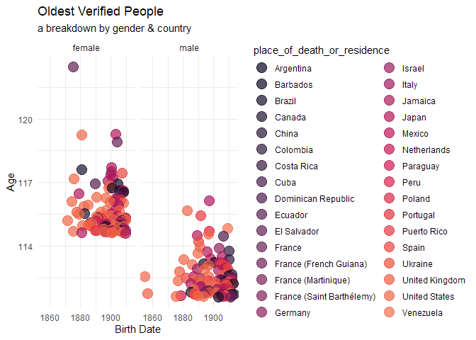

<!-- README.md is generated from README.Rmd. Please edit that file -->

# centenarians

<!-- badges: start -->
<!-- badges: end -->

The goal of centenarians is to provide centenarian and supercentenarian
data in R.

## Installation

You can install the development version of centenarians from
[GitHub](https://github.com/) with:

``` r
# install.packages("pak")
pak::pak("frankiethull/centenarians")
```

## Example Data Visualization

This is a basic example showing the package underlying dataset.

``` r
library(centenarians)
library(ggplot2)

centenarians_data |>
  ggplot() +
   geom_point(aes(x = birth_date, y = age, color = place_of_death_or_residence), 
              size = 5, alpha = .7) + 
  scale_color_viridis_d(option = "F", begin = .01, end = .7) +
facet_wrap(~gender) + 
  labs(
    title = "Oldest Verified People",
    subtitle = "a breakdown by gender & country",
    x = "Birth Date",
    y = "Age"
  ) + 
  theme_minimal()
```



``` r
str(centenarians_data)
#> tibble [201 × 8] (S3: tbl_df/tbl/data.frame)
#>  $ rank                       : int [1:201] 1 2 3 4 5 6 7 8 9 10 ...
#>  $ name                       : chr [1:201] "Jeanne Calment" "Kane Tanaka" "Sarah Knauss" "Lucile Randon" ...
#>  $ birth_date                 : Date[1:201], format: "1875-02-21" "1903-01-02" ...
#>  $ death_date                 : Date[1:201], format: "1997-08-04" "2022-04-19" ...
#>  $ age                        : num [1:201] 122 119 119 119 118 ...
#>  $ place_of_death_or_residence: chr [1:201] "France" "Japan" "United States" "France" ...
#>  $ gender                     : chr [1:201] "female" "female" "female" "female" ...
#>  $ still_alive                : chr [1:201] "deceased" "deceased" "deceased" "deceased" ...
```
